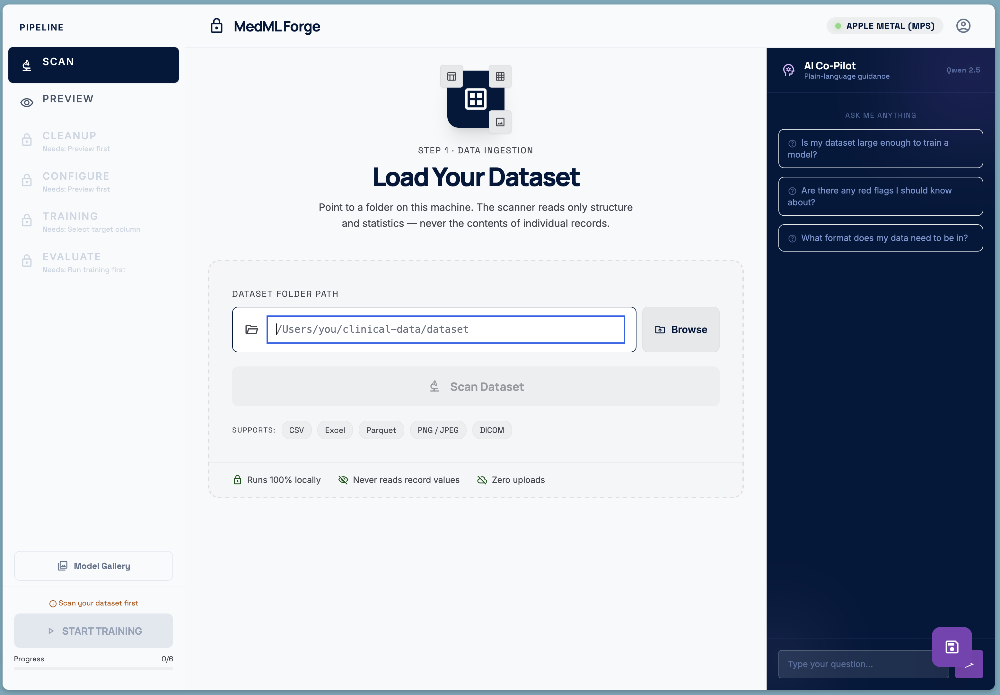
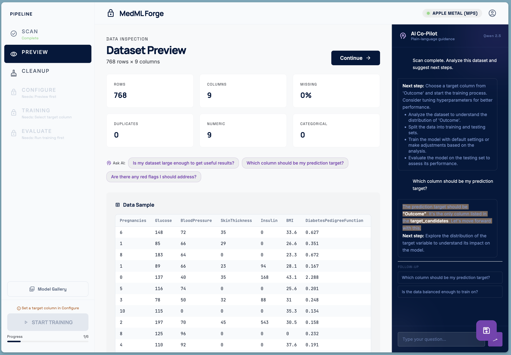
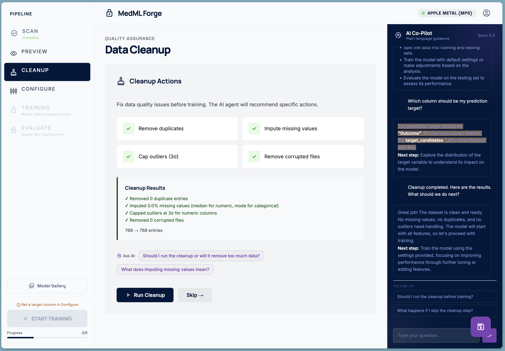
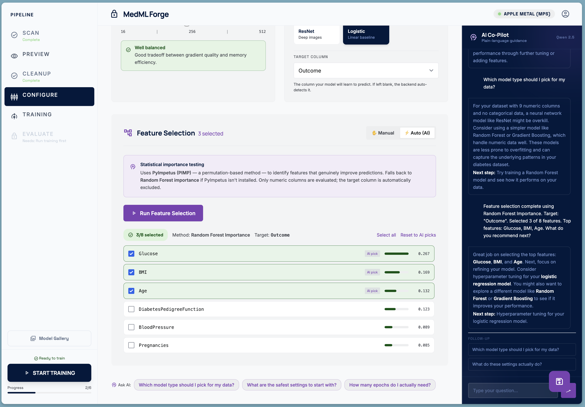
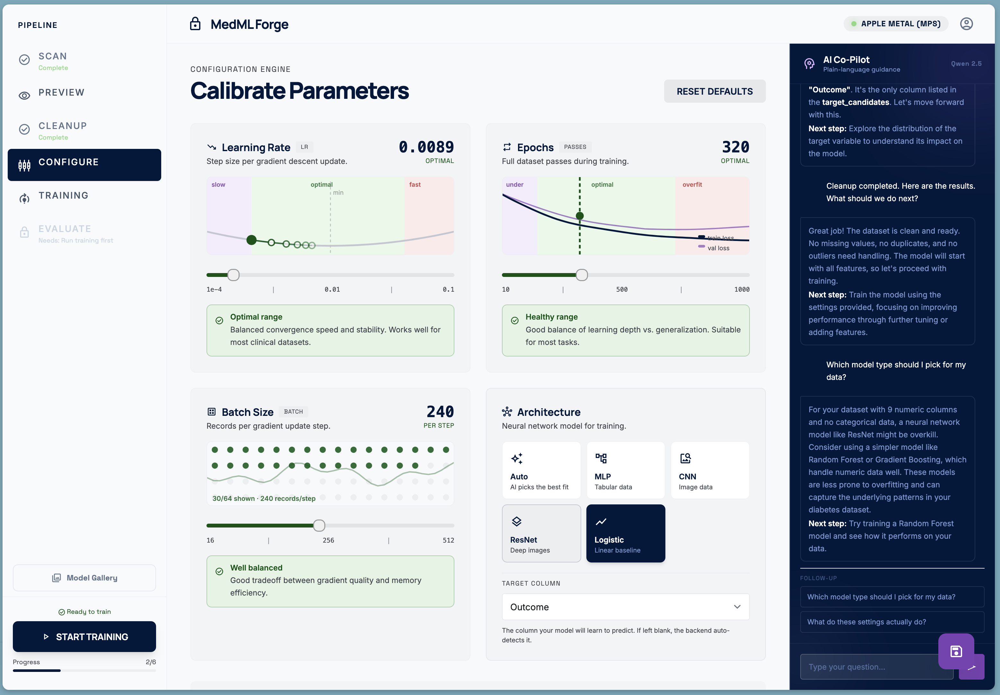
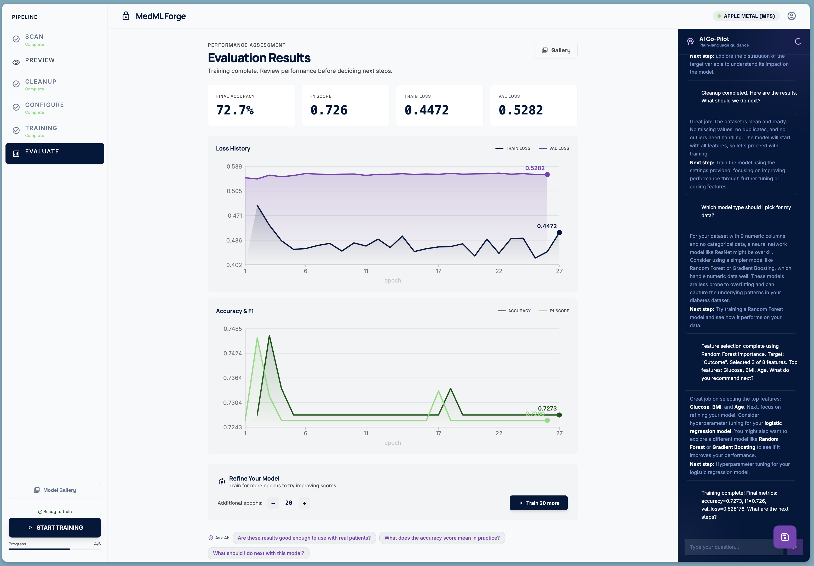
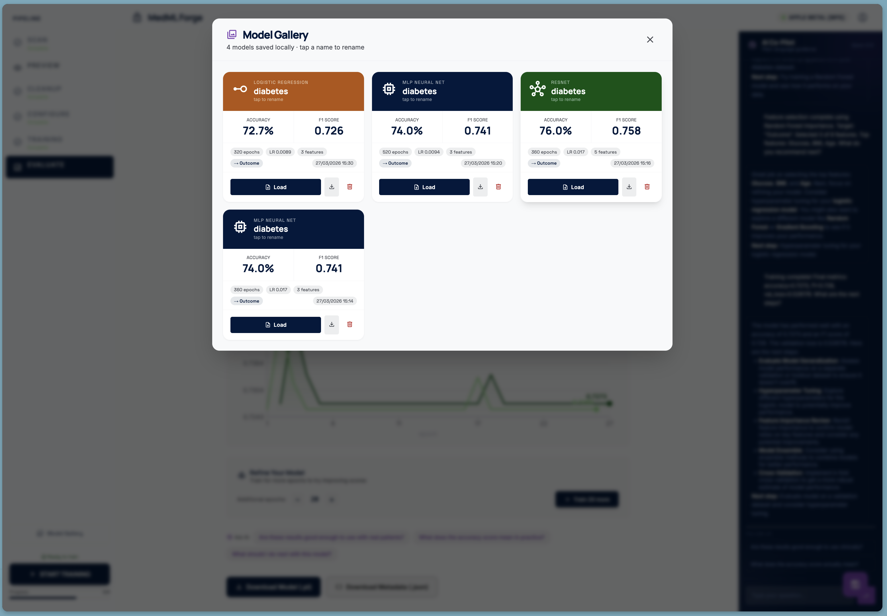

# MedML Forge

**Train machine learning models on your clinical data — completely on-device, no data ever leaves your machine.**

MedML Forge is a full ML pipeline for doctors and clinical researchers with no machine learning background required. Upload a dataset, let the AI guide you through cleanup and configuration, train a model with live metrics, and manage your model library — all running locally on your hardware.

> Built for [MLH Global Hackathon 2026](https://devpost.com/software/medml)

---

## Screenshots

<table>
  <tr>
    <td align="center" width="50%">
      
      <br /><sub><b>1 · Load Your Dataset</b></sub>
    </td>
    <td align="center" width="50%">
      
      <br /><sub><b>2 · Dataset Preview + AI Co-Pilot</b></sub>
    </td>
  </tr>
  <tr>
    <td align="center" width="50%">
      
      <br /><sub><b>3 · Automatic Data Cleanup</b></sub>
    </td>
    <td align="center" width="50%">
      
      <br /><sub><b>4 · Feature Selection</b></sub>
    </td>
  </tr>
  <tr>
    <td align="center" width="50%">
      
      <br /><sub><b>5 · Configure Parameters</b></sub>
    </td>
    <td align="center" width="50%">
      
      <br /><sub><b>6 · Evaluation Results</b></sub>
    </td>
  </tr>
  <tr>
    <td align="center" colspan="2">
      
      <br /><sub><b>7 · Model Gallery</b></sub>
    </td>
  </tr>
</table>

---

## What It Does

MedML Forge walks you through a guided 6-stage pipeline:

| Stage | What happens |
|-------|-------------|
| **Scan** | Point to a local file (CSV, Excel, Parquet, images). Metadata is scanned — raw data never moves. |
| **Preview** | Explore your dataset: column types, distributions, missing values, class balance. |
| **Cleanup** | One-click fixes — remove duplicates, impute missing values, cap outliers, drop corrupted rows. |
| **Configure** | Pick your target column, model architecture, and hyperparameters. The AI recommends settings based on your data. Statistical feature selection (PyImpetus / Random Forest) identifies genuinely predictive columns. |
| **Training** | Live epoch-by-epoch loss and accuracy streamed to your browser. Pause, add more epochs, or revert if scores dropped. |
| **Evaluate** | Final accuracy, F1, and loss curves. Save to the Model Gallery — rename, compare, download, or load for further training. |

---

## AI Co-Pilot

Every stage has a built-in AI assistant powered by a **local Qwen 2.5 LLM** (via llama.cpp). It:

- Receives the full pipeline context on every message (dataset stats, cleanup actions, selected features, live training metrics)
- Gives short, non-technical suggestions aimed at clinicians — not engineers
- Offers contextual "Ask" chips so you don't have to type
- Runs 100% on your hardware — no API calls, no data sent anywhere

---

## Privacy Guarantees

- All data processing runs locally
- LLM inference runs on your own CPU / GPU
- Scanner reads only file metadata — no row-level data is transmitted
- Training happens entirely on-device
- No cloud APIs, no telemetry, no uploads of any kind

---

## Architecture

```
┌─────────────────────────────────────────────────────┐
│                 React Dashboard                      │
│    (Pipeline stages · live metrics · AI panel)       │
│                    :5173                             │
└──────────┬────────────────────┬─────────────────────┘
           │                    │
    ┌──────▼──────┐     ┌───────▼──────┐
    │  ML Worker   │     │  Qwen 2.5    │
    │  (Flask)     │     │ (llama.cpp)  │
    │   :8081      │     │   :8080      │
    │              │     │              │
    │ • Data scan  │     │ • Reasoning  │
    │ • Training   │     │ • Advice     │
    │ • Cleanup    │     │ • Model rec  │
    │ • Features   │     │              │
    └──────┬───────┘     └──────────────┘
           │
    ┌──────▼──────┐
    │  Local Data  │
    │  (never      │
    │   leaves)    │
    └─────────────┘
```

---

## Quick Start

### macOS / Linux

```bash
chmod +x start.sh
./start.sh
```

The launcher will:
- Auto-detect your GPU (Apple Silicon MPS / NVIDIA CUDA / CPU)
- Download Qwen 2.5 3B (~2 GB, one-time)
- Install Python ML dependencies
- Start all services and open `http://localhost:5173`

### Docker

```bash
# NVIDIA GPU
docker build --build-arg BUILD_TYPE=cuda -t medml-forge .
docker run --gpus all -p 5173:5173 -v /path/to/data:/data medml-forge

# CPU only
docker build --build-arg BUILD_TYPE=cpu -t medml-forge .
docker run -p 5173:5173 -v /path/to/data:/data medml-forge
```

---

## Requirements

| Dependency | Version |
|-----------|---------|
| Node.js | 18+ |
| Python | 3.10+ |
| llama.cpp (`llama-server`) | latest |
| PyTorch | 2.0+ (CPU build is fine) |

Python packages are listed in [`ml-worker/requirements.txt`](ml-worker/requirements.txt).

---

## Configuration

Copy `.env.example` to `.env` to customise ports and LLM settings:

| Variable | Default | Description |
|----------|---------|-------------|
| `LLM_NGL` | 999 | GPU layers offloaded (999 = all) |
| `LLM_THREADS` | 4 | CPU threads for LLM inference |
| `LLM_CONTEXT` | 4096 | LLM context window |
| `UI_PORT` | 5173 | Dashboard port |
| `ML_WORKER_PORT` | 8081 | ML Worker port |

---

## Project Story

Read the full project story — inspiration, challenges, and lessons learned — on [Devpost](https://devpost.com/software/medml).
